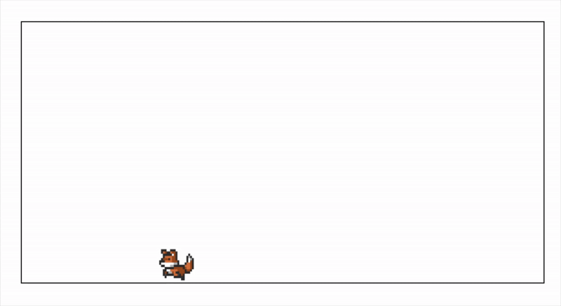

# sv-pets

could be cool



ex:

```svelte
<script lang="ts">
	import { Nest } from 'sv-pets';
</script>

<div class="container">
	<Nest animal="fox" />
</div>

<style>
	.container {
		height: 300px;
		width: 600px;
		border: 1px solid black;
	}
</style>
```
